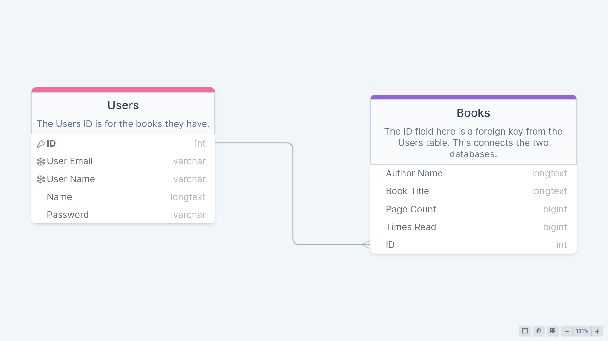

# Book Keeper
This an application to keep track of books that I have read and will read. 

## How it Works: 
DB stores book metadata, and via REST API, front end displays books using three.js

# Why? The Inspiration: 
Needed to learn full-stack ASAP.

# TODO: 
- Set up project using Spring Initializer

# How it Looks: 
Not like much. Yet. 

# Links: 
- https://www.baeldung.com/spring-boot-angular-web 
- https://spring.io/guides/gs/securing-web 
- https://docs.spring.io/spring-authorization-server/reference/getting-started.html 
- https://www.w3schools.com/java/default.asp 
- https://spring.io/guides/tutorials/rest
- https://docs.spring.io/spring-security/reference/features/authentication/index.html

- https://stackoverflow.blog/2020/03/02/best-practices-for-rest-api-design/
- https://www.freecodecamp.org/news/rest-vs-graphql-apis/#how-graphql-apis-work
- https://www.freecodecamp.org/news/stateful-vs-stateless-architectures-explained/
- https://www.freecodecamp.org/news/build-consume-and-document-a-rest-api/#how-to-consume-a-rest-api-on-a-front-end-react-app

